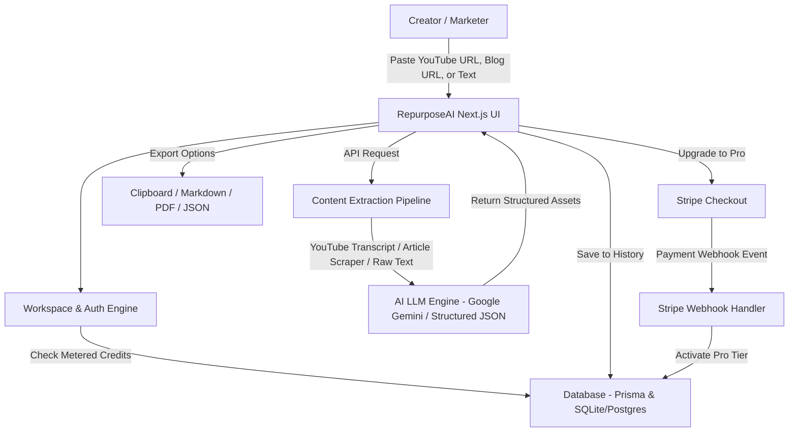

# RepurposeAI — AI-Powered Content Repurposing Platform

RepurposeAI is a production-grade SaaS web platform where creators, marketers, and founders paste a **YouTube video URL**, **blog post link**, or **raw transcript**, and an LLM automatically parses and transforms it into a multi-platform distribution asset bundle:
1. 💼 **LinkedIn Summary & Carousel Post** (Hook, body, takeaways, hashtags)
2. 🐦 **Twitter/X Thread** (Multi-tweet sequence with hooks, punchy bullets, and CTAs)
3. 🎬 **3 Short-Form Video Scripts** (Hooks, Visual cues, Audio voiceover, and CTAs for Reels/TikTok/Shorts)
4. 🔍 **SEO Meta Pack** (Optimized title, 160-char meta description, target keywords, suggested slug, and OpenGraph preview)
5. 📧 **Newsletter / Executive Brief** (TL;DR, key learnings, and actionable quote)

---

## Key Features & Architecture

```
                       ┌─────────────────────────┐
                       │   Creator / Marketer    │
                       └────────────┬────────────┘
                                    │
                                    │ Paste YouTube URL, Blog URL, Text
                                    ▼
                       ┌─────────────────────────┐
    ┌─────────────────►│ RepurposeAI Next.js UI  ├───────────────────────────────┐
    │                  └─┬──────┬─────────┬──────┘                               │
    │                    │      │         │                                      │
    │     Export Options │      │         │ API Request           Upgrade to Pro │
    │                    ▼      │         ▼                                      ▼
┌───┴───────────────────────┐   │   ┌───────────────────────────┐   ┌───────────────────────────┐
│ Clipboard / Markdown / PDF│   │   │Content Extraction Pipeline│   │      Stripe Checkout      │
└───────────────────────────┘   │   └─────────────┬─────────────┘   └─────────────┬─────────────┘
                                │                 │                               │
                                │                 │ YouTube Transcript / Article  │ Payment Webhook Event
                                │                 ▼                               ▼
                                │   ┌───────────────────────────┐   ┌───────────────────────────┐
                                │   │ AI LLM Engine (Gemini API)│   │  Stripe Webhook Handler   │
                                │   └─────────────┬─────────────┘   └─────────────┬─────────────┘
                                │                 │                               │
          Return Structured Assets                │                               │ Activate Pro Tier
                                └─────────────────┘                               │
                                        │                                         │
                        Save to History │                                         │
                                        ▼                                         ▼
                               ┌────────────────────────────────────────────────────────┐
                               │           Database (Prisma & SQLite/Postgres)          │
                               └────────────────────────▲───────────────────────────────┘
                                                        │
                                                        │ Check Metered Credits
                                                        │
                               ┌────────────────────────┴───────────────────────┐
                               │            Workspace & Auth Engine             │
                               └────────────────────────────────────────────────┘
```



---

## User Review Required

> [!IMPORTANT]
> - **Default Database**: Prisma ORM with SQLite will be configured by default for zero-setup local execution, fully compatible with switching to PostgreSQL/Supabase via `DATABASE_URL`.
> - **AI Integration**: Native Google Gemini Flash API (`@google/genai` or `@google/generative-ai`) with structured JSON schema output, plus an instant high-fidelity fallback generator so the platform functions immediately even before user supplies their own API key.
> - **Stripe Testing**: Full Stripe API & Webhook integration with environment variables, along with an interactive **"Simulate Stripe Webhook / Pro Activation"** test suite for seamless live demos and grading.

---

## Proposed Changes

### 1. Project Initialization & Foundation
- Initialize Next.js 15/14 project with TypeScript and Tailwind CSS in the workspace.
- Install core dependencies:
  - `lucide-react` (icons)
  - `@prisma/client`, `prisma` (database ORM)
  - `stripe` (payments & webhooks)
  - `canvas-confetti` & `@types/canvas-confetti` (success animations)
  - `jspdf` & `html2canvas` (PDF generation)
  - `youtube-transcript` / Cheerio parser (transcript and web scrapers)
  - `@google/genai` / `@google/generative-ai` (Gemini API)

### 2. Database & Multi-Tenancy Layer (`prisma/schema.prisma`)
- Models:
  - `User`: Email, name, plan tier (`FREE` | `PRO`), creditsUsed (0-3 for free, unlimited for pro), stripeCustomerId, stripeSubscriptionId, createdAt.
  - `Generation`: ID, userId, inputType (`YOUTUBE` | `BLOG` | `TEXT`), sourceUrl, title, originalContentSummary, tone, outputAssets (JSON: LinkedIn, Twitter thread, Video scripts, SEO meta, Newsletter), createdAt.
  - `ApiKey`: Optional user-supplied custom AI keys (Gemini / OpenAI).

### 3. Backend API Endpoints (`app/api/`)
- `POST /api/auth/session`: Workspace session management (guest login, account switcher, user profile).
- `POST /api/repurpose`: Extracts transcript/article text, verifies credit balance, calls Gemini structured LLM API, formats and stores generation in DB.
- `GET /api/generations`: Fetches user's generation history with search/filter.
- `GET /api/generations/[id]`: Retrieve and re-export a specific historical generation.
- `DELETE /api/generations/[id]`: Remove saved generation.
- `POST /api/stripe/checkout`: Create Stripe Checkout Session for Pro subscription.
- `POST /api/stripe/portal`: Customer billing portal session.
- `POST /api/webhooks/stripe`: Robust Stripe webhook handler for `checkout.session.completed`, `customer.subscription.created`, `customer.subscription.updated`, and `customer.subscription.deleted`.
- `POST /api/dev/simulate-pro`: Dev/Demo endpoint to toggle Pro subscription state for reviewers without credit card entry.

### 4. Frontend UI & Interactive Workflows (`app/`)
- **Modern Glassmorphic Dark/Light Dashboard**:
  - Top Navigation: Brand badge, User profile switcher, Credit Usage meter (`X / 3 Free Generations Used` or `PRO Unlimited`), Upgrade to Pro button, Settings/API Key modal.
  - Input Studio:
    - Tab 1: 🎥 **YouTube Video URL** (auto-fetches thumbnail, title, and transcript).
    - Tab 2: 📰 **Blog Post / Article URL** (fetches clean article text).
    - Tab 3: ✍️ **Paste Raw Text / Transcript** (live word/token counter).
    - Repurposing Config: Audience Tone selector (Viral/Engaging, Professional/B2B, Educational/Storyteller, Concise/Punchy), Target Niche, Custom Instructions.
    - Generate button with animated loading steps (Fetching Transcript → Analyzing Key Themes → Synthesizing Distribution Assets).
  - Generated Assets Output Hub:
    - **LinkedIn Post**: Formatted preview, character count, hook highlight, 1-click copy, copy formatted with emojis.
    - **Twitter/X Thread**: Tweet card sequence (1/N to N/N), individual tweet copy buttons, tweet length indicators (280 char limit bar), copy whole thread button.
    - **3 Short-Form Video Scripts (Reels/TikTok/Shorts)**: Visual cues & B-roll instructions, hook voiceover line, teleprompter mode viewer, script timing estimate.
    - **SEO Meta Pack**: Google search snippet preview card, meta title, meta description (160 character limit badge), keyword tags, suggested slug.
    - **Newsletter / Executive Brief**: TL;DR bullet points, quote callout, key actionable takeaways.
  - **Export Studio**:
    - 📋 Copy All to Clipboard
    - 📄 Export to Markdown (.md)
    - 📑 Export to Styled PDF (.pdf)
    - 📦 Export to JSON
  - **Generation History Drawer / Library**:
    - Access previous runs, view source URLs, re-download or copy previous assets.
  - **Pricing / Upgrade Modal**:
    - Free Tier vs Pro Tier comparison table with Stripe Checkout integration and instant live demo mode.
