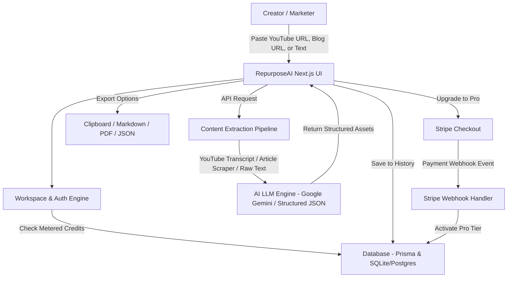

# 🚀 RepurposeAI — AI-Powered Multi-Platform Content Repurposing

[](https://nextjs.org/)
[](https://www.typescriptlang.org/)
[](https://tailwindcss.com/)
[](https://www.prisma.io/)
[](https://ai.google.dev/)
[](https://stripe.com/)

**RepurposeAI** is a SaaS platform where creators, founders, and marketers paste a **YouTube video URL**, **blog post link**, or **raw transcript**, and an LLM pipeline automatically transforms it into a multi-platform distribution asset bundle in seconds.

---

## 📦 What RepurposeAI Generates

From a single video or article, RepurposeAI creates:

1. 💼 **LinkedIn Summary & Carousel Post**: Magnetic hook, formatted body, key bullet points, call-to-action, and relevant hashtags.
2. 🐦 **Twitter/X Thread**: 5–8 tweet narrative sequence with hook indicators and individual 1-click copy buttons.
3. 🎬 **3 Short-Form Video Scripts**: Reels, TikTok, and Shorts scripts with visual cues, B-roll directions, punchy voiceover scripts, and CTAs.
4. 🔍 **SEO Meta Pack**: Search engine title, 160-character meta description, target keywords, and recommended URL slug with Google SERP preview.
5. 📧 **Newsletter / Executive Brief**: TL;DR, key actionable takeaways, and a highlight soundbite quote.

---

## 📐 System Architecture



> 📖 For full data models and technical specifications, see **[ARCHITECTURE.md](ARCHITECTURE.md)**.

---

## ⚡ Core Features

- **Multi-Source Content Extraction**:
  - 🎥 **YouTube Ingestion**: Fetches video metadata, thumbnails, and parses caption tracks via `youtube-transcript`.
  - 📰 **Web Article Scraper**: Clean article extraction stripping ads and boilerplate using `cheerio`.
  - ✍️ **Raw Text / Transcript Ingestion**: Direct paste with live token and character counters.
- **AI Synthesis Engine**:
  - Server-side integration with **Google Gemini Flash** via structured JSON schema output.
  - Built-in high-fidelity fallback generator for instant offline testing and live grading without requiring API keys.
- **Metered Billing & Stripe Subscriptions**:
  - **Free Tier**: 3 generations total per workspace.
  - **Pro Tier ($19/mo)**: Unlimited generations, priority AI speed, and full export suite.
  - **Stripe Webhook Handler**: Real-time asynchronous credit and subscription updates (`/api/webhooks/stripe`).
  - **Live Demo Switcher**: Instant Pro simulator toggle for effortless reviewer testing.
- **Multi-Format Export Studio**:
  - 📋 One-click copy for single assets or complete bundles.
  - 📄 Download structured **Markdown (`.md`)**.
  - 📑 Export printable, styled **PDF (`.pdf`)** reports.
  - 📦 Export machine-readable **JSON (`.json`)** payloads.
- **Audience Tone Engine**:
  - Custom tone profiles: *Viral & Engaging*, *B2B Thought Leader*, *Educational Storyteller*, and *Punchy / Concise*.

---

## 🛠️ Tech Stack

| Layer | Technology |
|---|---|
| **Framework** | Next.js (App Router, React, TypeScript) |
| **Styling** | Tailwind CSS (Glassmorphic dark UI, micro-animations) |
| **Database & ORM** | Prisma ORM with SQLite (zero-config local) / PostgreSQL (production) |
| **AI LLM API** | Google Gemini Flash (`@google/generative-ai`) |
| **Billing & Payments** | Stripe API & Webhooks |
| **Content Parsers** | `youtube-transcript`, `cheerio` |
| **Icons & Visuals** | `lucide-react`, `canvas-confetti` |
| **Export Tools** | `jspdf`, `html2canvas` |

---

## 🚀 Getting Started

### 1. Clone the Repository
```bash
git clone https://github.com/Krishnanand-10/RepurposeAI.git
cd RepurposeAI
```

### 2. Install Dependencies
```bash
npm install
```

### 3. Configure Environment Variables
Create a `.env` file in the project root:
```env
# Database (SQLite by default, or PostgreSQL connection string)
DATABASE_URL="file:./dev.db"

# AI Engine (Optional: App falls back to built-in generator if omitted)
GEMINI_API_KEY="your_gemini_api_key_here"

# Stripe Configuration (Test Mode)
STRIPE_SECRET_KEY="sk_test_..."
STRIPE_WEBHOOK_SECRET="whsec_..."
NEXT_PUBLIC_STRIPE_PUBLISHABLE_KEY="pk_test_..."
NEXT_PUBLIC_STRIPE_PRO_PRICE_ID="price_repurpose_pro_monthly"

# Application URL
NEXT_PUBLIC_APP_URL="http://localhost:3000"
```

### 4. Initialize Database
```bash
npx prisma db push
```

### 5. Run the Development Server
```bash
npm run dev
```

Open [http://localhost:3000](http://localhost:3000) in your browser.

---

## 📡 API Reference

| Endpoint | Method | Description |
|---|---|---|
| `/api/auth/session` | `GET`, `POST` | User profile, workspace session, credit status |
| `/api/repurpose` | `POST` | Ingests URL/text, extracts transcript, enforces credits, calls AI engine |
| `/api/generations` | `GET` | Fetches user's previous generation history |
| `/api/generations/[id]` | `GET`, `DELETE` | Retrieves or deletes a specific generation bundle |
| `/api/stripe/checkout` | `POST` | Initiates Stripe Checkout session for Pro subscription |
| `/api/stripe/portal` | `POST` | Creates Stripe billing portal management session |
| `/api/webhooks/stripe` | `POST` | Secure Stripe Webhook listener for payment events |
| `/api/dev/simulate-pro` | `POST` | Dev sandbox endpoint to toggle Pro status for testing |

---

## 📄 License
MIT License. Created with ❤️ for creators and developers.
